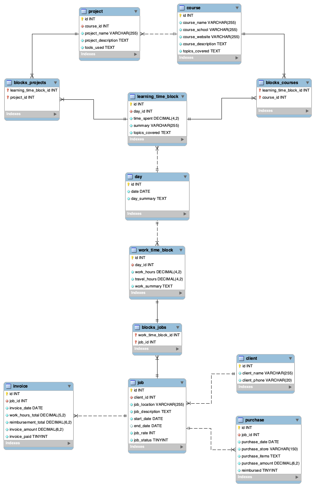
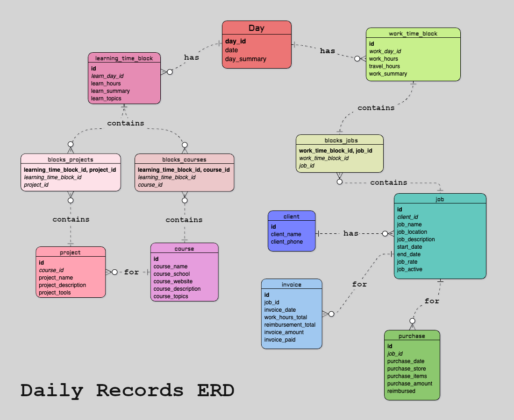

# Daily Records
## By Cory Suzuki

Video overview: https://www.youtube.com/watch?v=bL6vYFwRMJg  

Full Process HTML document: https://mypetlobster.github.io/daily-records-process/

# Scope

In this section you should answer the following questions:

* What is the purpose of your database?
* Which people, places, things, etc. are you including in the scope of your database?
* Which people, places, things, etc. are *outside* the scope of your database?

## Purpose of the database: 
The purpose of Daily Records database is to keep track of the time I spend on jobs and time 
spent learning. I will be able to retrieve information and generate invoices with the click 
of a button. I'm an independent contractor, so I need to keep track of all of my hours for 
all my different jobs and clients. Prior to this project, I was using a folder in my iPhone 
Notes app. I wanted to be able to keep track of my time in a more organized way, and figured 
a database would be a good way to do that.

## The following entities are included in the scope of the database:
* Days, an overview including summary of each day and the date
* Jobs, a list of jobs I've worked on, including the client, the rate, start and end dates, description and status
* Clients, a list of clients I've worked for, including the name and contact info
* Job related purchases, a list of purchases I've made for jobs, including the date, amount, and description
* Working time blocks, a list of time blocks I've worked on jobs, including the date, start and end times, and description
* Learning time blocks, a list of time blocks I've spent learning, including the date, start and end times, and description
* Projects, a list of programming projects I've worked on, including the name, description, and status
* Courses, a list of courses I've taken, including the name, description, and topics covered
* Invoices, a list of invoices I've generated, including the date, client, amount, and status

## Outside the scope of the database are:
* Financial transactions and bank account information
* Mileage or travel data beyond time spent traveling to and from jobs
* Personal information beyond contact information for clients

# Functional requirements 

## This database will support:
* CRUD operations for all my time keeping records relating to work and education
* Generating invoices
* Generating reports of total hours spent on jobs and learning, delineated by start and end dates, and grouped by job or learning
* Generating reports of total hours spent learning specific topics, or hours spent working for specific clients

## This database will not support:
* Financial transactions and bank account information
* Mileage or travel data beyond time spent traveling to and from jobs
* Future time block scheduling. This is for record keeping not planning.
* Automated tracking of location, though I may integrate my Google Maps timeline in the future.

# Representation

## Entities

The database includes the following entities:

## Work Related Tables:

### Day
The `day` table includes:
* `id`, a unique identifier for each day as an `INT unsigned`. This is the `PRIMARY KEY`.
* `day_date`, the specific date as `DATE`.
* `day_summary`, a textual summary of the day's activities as `TEXT`.

### Work Time Block
The `work_time_block` table includes:
* `id`, a unique identifier for each work time block as an `INT unsigned`, marked as the `PRIMARY KEY`.
* `work_day_id`, the day of the work time block as `INT unsigned`. This is a `FOREIGN KEY` linking to the `day` table.
* `work_hours`, the number of hours worked as `DECIMAL(4,2)`.
* `travel_hours`, the number of hours traveled as `DECIMAL(4,2)`.
* `work_summary`, a summary of the work done as `TEXT`.

### Client
The `client` table includes:
* `id`, a unique identifier for each client as an `INT unsigned`, designated as the `PRIMARY KEY`.
* `client_name`, the name of the client as `VARCHAR(255)` for their name.
* `client_phone`, the phone number of the client as `VARCHAR(20)`.

### Job
The `job` table includes:
* `id`, a unique identifier for each job as an `INT unsigned`, serving as the `PRIMARY KEY`.
* `client_id`, linking to the `client` table as an `INT unsigned`, with a `FOREIGN KEY` constraint.
* `job_name`, the name of the job as `VARCHAR(255)`.
* `job_location`, the location of the job as `VARCHAR(255)`.
* `job_description`, a description of the job as `TEXT`.
* `start_date` and `end_date`, specifying the duration of the job as `DATE`.
* `end_date` is `NULL` if the job is still active.
* `job_rate`, the rate charged for the job as `INT unsigned`.
* `job_active`, the status of the job as `BOOLEAN`. 1 indicates the job is active, 0 indicates the job is inactive.

### Purchase
The `purchase` table includes:
* `id`, a unique identifier for each purchase as an `INT unsigned`, marked as the `PRIMARY KEY`.
* `job_id`, linking to the `job` table as an `INT unsigned`, with a `FOREIGN KEY` constraint.
* `purchase_date`, the date of the purchase as `DATE`.
* `purchase_store`, the store where the purchase was made as `VARCHAR(150)`.
* `purchase_items`, a description of the items purchased as `TEXT`.
* `purchase_amount`, the total amount of the purchase as `DECIMAL(6,2)`.
* `reimbursed`, a `BOOLEAN` indicating whether the purchase was reimbursed or not.

### Invoice
The `invoice` table includes:
* `id`, a unique identifier for each invoice as an `INT unsigned`, serving as the `PRIMARY KEY`.
* `job_id`, linking to the `job` table as an `INT unsigned`, with a `FOREIGN KEY` constraint.
* `invoice_date`, the date the invoice was issued as `DATE`.
* `work_hours_total`, the total work hours billed in the invoice as `DECIMAL(5,2)`.
* `reimbursement_total`, the total amount for reimbursements as `DECIMAL(6,2)`.
* `invoice_amount`, the total amount of the invoice as `DECIMAL(6,2)`.
* `invoice_paid`, a `BOOLEAN` indicating whether the invoice was paid or not.

### Blocks Jobs
The `blocks_jobs` table, an association table, includes:
* `work_time_block_id`, an `INT unsigned` linking to the `work_time_block` table, part of the composite `PRIMARY KEY`.
* `job_id`, an `INT unsigned` linking to the `job` table, part of the composite `PRIMARY KEY`.
* Two `FOREIGN KEY` constraints, `fk_blocks_jobs_work_block` and `fk_block_jobs_job`, ensure data integrity.

 

## Education Related Tables:

### Learning Time Block
The `learning_time_block` table includes:
* `id`, a unique identifier for each time block as an `INT unsigned`, designated as the `PRIMARY KEY`.
* `learn_day_id`, the date of the learning time block as `INT unsigned`. This is a `FOREIGN KEY` linking to the `day` table.
* `learn_hours`, the amount of time spent learning as `DECIMAL(4,2)`.
* `learn_summary`, a brief summary of the learning session as `VARCHAR(255)`.
* `learn_topics`, topics covered during the learning session as `TEXT`.

### Course
The `course` table includes:
* `id`, a unique identifier for each course as an `INT unsigned`, serving as the `PRIMARY KEY`.
* `course_name`, the name of the course as `VARCHAR(255)`.
* `course_school`, the institution offering the course as `VARCHAR(255)`.
* `course_website`, the website for the course as `VARCHAR(255)`.
* `course_description`, a description of the course as `TEXT`.
* `course_topics`, topics covered in the course as `TEXT`.

### Project
The `project` table includes:
* `id`, a unique identifier for each project as an `INT unsigned`, marked as the `PRIMARY KEY`.
* `course_id`, an `INT unsigned` linking to the `course` table, with a `FOREIGN KEY` constraint.
* `project_name`, the name of the project as `VARCHAR(255)`.
* `project_description`, a detailed description of the project as `TEXT`.
* `project_tools`, a list of tools used in the project as `TEXT`.

### Blocks Courses
The `blocks_courses` table, an association table, includes:
* `learning_time_block_id`, an `INT unsigned` linking to the `learning_time_block` table, part of the composite `PRIMARY KEY`.
* `course_id`, an `INT unsigned` linking to the `course` table, part of the composite `PRIMARY KEY`.
* Two `FOREIGN KEY` constraints, `fk_blocks_courses_learning_block` and `fk_blocks_courses_course`, ensure data integrity.

### Blocks Projects
The `blocks_projects` table, an association table, includes:
* `learning_time_block_id`, an `INT unsigned` linking to the `learning_time_block` table, part of the composite `PRIMARY KEY`.
* `project_id`, an `INT unsigned` linking to the `project` table, part of the composite `PRIMARY KEY`.
* Two `FOREIGN KEY` constraints, `fk_blocks_projects_learning_block` and `fk_blocks_projects_project`, ensure data integrity.

## Relationships

Here are two entity relationship diagrams describing the relationships among the entities in the database, the only differences
are visual. The first was created with MySQL Workbench, and the second was created with visual-paradigm.com.
 
 

### MySQL Workbench

### Visual Paradigm

 
 

* The `day` table is linked to `learning_time_block` and `work_time_block` indicating the relationship between days and different types of work or learning activities.
* `blocks_courses` and `blocks_projects` establish many-to-many relationships between `learning_time_block` and the `course` and `project` entities respectively.
* `blocks_jobs` links `work_time_block` and `job` in a many-to-many relationship.
* `purchase` and `invoice` are linked to `job`, showing the financial aspects related to each job.

## Optimizations

* Indexes could be added to columns frequently involved in search and join operations, such as `job_id` in `purchase` and `invoice` tables, and `day_id` in `learning_time_block` and `work_time_block` tables for faster query processing.

## Limitations

* The current schema is designed for individual job management and doesn't account for scenarios like multiple employees working on the same job or handling bulk purchases across different jobs.