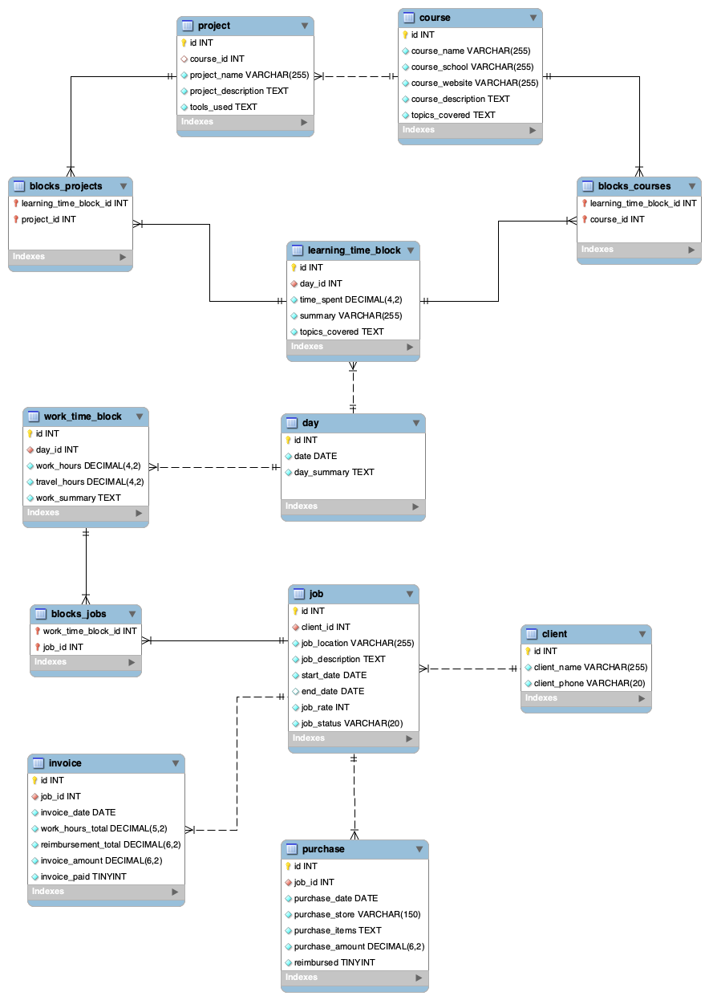

# Daily Records (Design Document)
By Cory Suzuki

Video overview: <URL HERE>

## Scope

In this section you should answer the following questions:

* What is the purpose of your database?
* Which people, places, things, etc. are you including in the scope of your database?
* Which people, places, things, etc. are *outside* the scope of your database?

### Purpose of the database: 
The purpose of Daily Records database is to keep track of the time I spend on jobs and time 
spent learning. I will be able to retrieve information and generate invoices with the click 
of a button. I'm an independent contractor, so I need to keep track of all of my hours for 
all my different jobs and clients. Prior to this project, I was using a folder in my iPhone 
Notes app. I wanted to be able to keep track of my time in a more organized way, and figured 
a database would be a good way to do that.

### The following entities are included in the scope of the database:
* Days, an overview including summary of each day and the date
* Jobs, a list of jobs I've worked on, including the client, the rate, start and end dates, description and status
* Clients, a list of clients I've worked for, including the name and contact info
* Job related purchases, a list of purchases I've made for jobs, including the date, amount, and description
* Working time blocks, a list of time blocks I've worked on jobs, including the date, start and end times, and description
* Learning time blocks, a list of time blocks I've spent learning, including the date, start and end times, and description
* Projects, a list of programming projects I've worked on, including the name, description, and status
* Courses, a list of courses I've taken, including the name, description, and topics covered
* Invoices, a list of invoices I've generated, including the date, client, amount, and status

### Outside the scope of the database are:
* Financial transactions and bank account information
* Mileage or travel data beyond time spent traveling to and from jobs
* Personal information beyond contact information for clients

## Functional requirements 

### This database will support:
* CRUD operations for all entities
* Generating invoices
* Generating reports of total hours spent on jobs and learning, delineated by start and end dates, and grouped by job or learning
* Generating reports of total hours spent learning specific topics, or hours spent working for specific clients

### This database will not support:
* Financial transactions and bank account information
* Mileage or travel data beyond time spent traveling to and from jobs
* Personal information beyond contact information for clients
* Future time block scheduling. This is for record keeping not planning.
* Automated tracking of location, though I may integrate my Google Maps timeline in the future.

## Representation

### Entities

The database includes the following entities:

#### Day

The `day` table includes:

* `id`, a unique identifier for each day as an `INT unsigned`. This is the `PRIMARY KEY`.
* `date`, the specific date as `DATE`.
* `day_summary`, a textual summary of the day's activities as `TEXT`.

#### Project

The `project` table includes:

* `id`, a unique identifier for each project as an `INT unsigned`, marked as the `PRIMARY KEY`.
* `course_id`, an `INT unsigned` linking to the `course` table, with a `FOREIGN KEY` constraint.
* `project_name`, the name of the project as `VARCHAR(255)`.
* `project_description`, a detailed description of the project as `TEXT`.
* `tools_used`, a list of tools used in the project as `TEXT`.

#### Course

The `course` table includes:

* `id`, a unique identifier for each course as an `INT unsigned`, serving as the `PRIMARY KEY`.
* `course_name`, the name of the course as `VARCHAR(255)`.
* `course_school`, the institution offering the course as `VARCHAR(255)`.
* `course_website`, the website for the course as `VARCHAR(255)`.
* `course_description`, a description of the course as `TEXT`.
* `topics_covered`, topics covered in the course as `TEXT`.

#### Learning Time Block

The `learning_time_block` table includes:

* `id`, a unique identifier for each time block as an `INT unsigned`, designated as the `PRIMARY KEY`.
* `day_id`, linking to the `day` table as an `INT unsigned`, with a `FOREIGN KEY` constraint.
* `time_spent`, the amount of time spent learning as `DECIMAL(4,2)`.
* `summary`, a brief summary of the learning session as `VARCHAR(255)`.
* `topics_covered`, topics covered during the learning session as `TEXT`.

#### Blocks Courses

The `blocks_courses` table, an association table, includes:

* `learning_time_block_id`, an `INT unsigned` linking to the `learning_time_block` table, part of the composite `PRIMARY KEY`.
* `course_id`, an `INT unsigned` linking to the `course` table, part of the composite `PRIMARY KEY`.
* Two `FOREIGN KEY` constraints, `fk_blocks_courses_learning_block` and `fk_blocks_courses_course`, ensure data integrity.

#### Blocks Projects

The `blocks_projects` table, an association table, includes:

* `learning_time_block_id`, an `INT unsigned` linking to the `learning_time_block` table, part of the composite `PRIMARY KEY`.
* `project_id`, an `INT unsigned` linking to the `project` table, part of the composite `PRIMARY KEY`.
* Two `FOREIGN KEY` constraints, `fk_blocks_projects_learning_block` and `fk_blocks_projects_project`, ensure data integrity.

#### Work Time Block

The `work_time_block` table includes:

* `id`, a unique identifier for each work time block as an `INT unsigned`, marked as the `PRIMARY KEY`.
* `day_id`, linking to the `day` table as an `INT unsigned`, with a `FOREIGN KEY` constraint.
* `work_hours`, the number of hours worked as `DECIMAL(4,2)`.
* `travel_hours`, the number of hours traveled as `DECIMAL(4,2)`.
* `work_summary`, a summary of the work done as `TEXT`.

#### Blocks Jobs

The `blocks_jobs` table, an association table, includes:

* `work_time_block_id`, an `INT unsigned` linking to the `work_time_block` table, part of the composite `PRIMARY KEY`.
* `job_id`, an `INT unsigned` linking to the `job` table, part of the composite `PRIMARY KEY`.
* Two `FOREIGN KEY` constraints, `fk_blocks_jobs_work_block` and `fk_block_jobs_job`, ensure data integrity.

#### Job

The `job` table includes:

* `id`, a unique identifier for each job as an `INT unsigned`, serving as the `PRIMARY KEY`.
* `client_id`, linking to the `client` table as an `INT unsigned`, with a `FOREIGN KEY` constraint.
* `job_location`, the location of the job as `VARCHAR(255)`.
* `job_description`, a description of the job as `TEXT`.
* `start_date` and `end_date`, specifying the duration of the job as `DATE`.
* `job_rate`, the rate charged for the job as `INT unsigned`.
* `job_status`, the status of the job as `VARCHAR(20)`.

#### Client

The `client` table includes:

* `id`, a unique identifier for each client as an `INT unsigned`, designated as the `PRIMARY KEY`.
* `client_name`, the name of the client as `VARCHAR(255)` for their name.
* `client_phone`, the phone number of the client as `VARCHAR(20)`.

#### Purchase

The `purchase` table includes:

* `id`, a unique identifier for each purchase as an `INT unsigned`, marked as the `PRIMARY KEY`.
* `job_id`, linking to the `job` table as an `INT unsigned`, with a `FOREIGN KEY` constraint.
* `purchase_date`, the date of the purchase as `DATE`.
* `purchase_store`, the store where the purchase was made as `VARCHAR(150)`.
* `purchase_items`, a description of the items purchased as `TEXT`.
* `purchase_amount`, the total amount of the purchase as `DECIMAL(6,2)`.
* `reimbursed`, a `BOOLEAN` indicating whether the purchase was reimbursed or not.

#### Invoice

The `invoice` table includes:

* `id`, a unique identifier for each invoice as an `INT unsigned`, serving as the `PRIMARY KEY`.
* `job_id`, linking to the `job` table as an `INT unsigned`, with a `FOREIGN KEY` constraint.
* `invoice_date`, the date the invoice was issued as `DATE`.
* `work_hours_total`, the total work hours billed in the invoice as `DECIMAL(5,2)`.
* `reimbursement_total`, the total amount for reimbursements as `DECIMAL(6,2)`.
* `invoice_amount`, the total amount of the invoice as `DECIMAL(6,2)`.
* `invoice_paid`, a `BOOLEAN` indicating whether the invoice was paid or not.

### Relationships

Here is an entity relationship diagram describing the relationships among the entities in the database.

* The `day` table is linked to `learning_time_block` and `work_time_block` indicating the relationship between days and different types of work or learning activities.
* `blocks_courses` and `blocks_projects` establish many-to-many relationships between `learning_time_block` and the `course` and `project` entities respectively.
* `blocks_jobs` links `work_time_block` and `job` in a many-to-many relationship.
* `purchase` and `invoice` are linked to `job`, showing the financial aspects related to each job.

### Optimizations

* Indexes could be added to columns frequently involved in search and join operations, such as `job_id` in `purchase` and `invoice` tables, and `day_id` in `learning_time_block` and `work_time_block` tables for faster query processing.

### Limitations

* The current schema is designed for individual job management and doesn't account for scenarios like multiple employees working on the same job or handling bulk purchases across different jobs.

# Design Document

By Carter Zenke

Video overview: (Normally there would be a URL here, but not for this sample assignment!)

## Scope

The database for CS50 SQL includes all entities necessary to facilitate the process of tracking student progress and leaving feedback on student work. As such, included in the database's scope is:

* Students, including basic identifying information
* Instructors, including basic identifying information
* Student submissions, including the time at which the submission was made, the correctness score it received, and the problem to which the submission is related
* Problems, which includes basic information about the course's problems
* Comments from instructors, including the content of the comment and the submission on which the comment was left

Out of scope are elements like certificates, final grades, and other non-core attributes.

## Functional Requirements

This database will support:

* CRUD operations for students and instructors
* Tracking all versions of student submissions, including multiple submissions for the same problem
* Adding multiple comments to a student submission from instructors

Note that in this iteration, the system will not support students responding to comments.

## Representation

Entities are captured in SQLite tables with the following schema.

### Entities

The database includes the following entities:

#### Students

The `students` table includes:

* `id`, which specifies the unique ID for the student as an `INTEGER`. This column thus has the `PRIMARY KEY` constraint applied.
* `first_name`, which specifies the student's first name as `TEXT`, given `TEXT` is appropriate for name fields.
* `last_name`, which specifies the student's last name. `TEXT` is used for the same reason as `first_name`.
* `github_username`, which specifies the student's GitHub username. `TEXT` is used for the same reason as `first_name`. A `UNIQUE` constraint ensures no two students have the same GitHub username.
* `started`, which specifies when the student began the course. Timestamps in SQLite can be conveniently stored as `NUMERIC`, per SQLite documentation at <https://www.sqlite.org/datatype3.html>. The default value for the `started` attribute is the current timestamp, as denoted by `DEFAULT CURRENT_TIMESTAMP`.

#### Instructors

The `instructors` table includes:

* `id`, which specifies the unique ID for the instructor as an `INTEGER`. This column thus has the `PRIMARY KEY` constraint applied.
* `first_name`, which specifies the instructor's first name as `TEXT`.
* `last_name`, which specifies the instructor's last name as `TEXT`.

All columns in the `instructors` table are required and hence should have the `NOT NULL` constraint applied. No other constraints are necessary.

#### Problems

The `problems` table includes:

* `id`, which specifies the unique ID for the instructor as an `INTEGER`. This column thus has the `PRIMARY KEY` constraint applied.
* `problem_set`, which is an `INTEGER` specifying the number of the problem set of which the problem is a part. Problem sets are *not* represented separately, given that each is only identified by a number.
* `name`, which is the name of the problem set as `TEXT`.

All columns in the `problems` table are required, and hence should have the `NOT NULL` constraint applied. No other constraints are necessary.

#### Submissions

The `submissions` table includes:

* `id`, which specifies the unique ID for the submission as an `INTEGER`. This column thus has the `PRIMARY KEY` constraint applied.
* `student_id`, which is the ID of the student who made the submission as an `INTEGER`. This column thus has the `FOREIGN KEY` constraint applied, referencing the `id` column in the `students` table to ensure data integrity.
* `problem_id`, which is the ID of the problem which the submission solves as an `INTEGER`. This column thus has the `FOREIGN KEY` constraint applied, referencing the `id` column in the `problems` table to ensure data integrity.
* `submission_path`, which is the path, relative to the database, at which the submission files are stored. It is assumed that all submissions are uploaded to the same server on which the database file is stored, and that submission files can be accessed by following the relative path from the database. Given that this attribute stores a filepath, not the submission files themselves, it is of type affinity `TEXT`.
* `correctness`, which is the score, as a float from 0 to 1.0, the student received on the assignment. This column is represented with a `NUMERIC` type affinity, which can store either floats or integers.
* `timestamp`, which is the timestamp at which the submission was made.

All columns are required and hence have the `NOT NULL` constraint applied where a `PRIMARY KEY` or `FOREIGN KEY` constraint is not. The `correctness` column has an additional constraint to check if its value is greater than 0 and less than or equal 1, given that this is the valid range for a correctness score. Similar to the student's `started` attribute, the submission `timestamp` attribute defaults to the current timestamp when a new row is inserted.

#### Comments

The `comments` table includes:

* `id`, which specifies the unique ID for the submission as an `INTEGER`. This column thus has the `PRIMARY KEY` constraint applied.
* `instructor_id`, which specifies the ID of the instructor who wrote the comment as an `INTEGER`. This column thus has the `FOREIGN KEY` constraint applied, referencing the `id` column in the `instructors` table, which ensures that each comment be referenced back to an instructor.
* `submission_id`, which specifies the ID of the submission on which the comment was written as an `INTEGER`. This column thus has the `FOREIGN KEY` constraint applied, referencing the `id` column in the `submissions` table, which ensures each comment belongs to a particular submission.
* `contents`, which contains the contents of the columns as `TEXT`, given that `TEXT` can still store long-form text.

All columns are required and hence have the `NOT NULL` constraint applied where a `PRIMARY KEY` or `FOREIGN KEY` constraint is not.

### Relationships

The below entity relationship diagram describes the relationships among the entities in the database.

As detailed by the diagram:

* One student is capable of making 0 to many submissions. 0, if they have yet to submit any work, and many if they submit to more than one problem (or make more than one submission to any one problem). A submission is made by one and only one student. It is assumed that students will submit individual work (not group work).
* A submission is associated with one and only one problem. At the same time, a problem can have 0 to many submissions: 0 if no students have yet submitted work to that problem, and many if more than one student has submitted work for that problem.
* A comment is associated with one and only one submission, whereas a submission can have 0 to many comments: 0 if an instructor has yet to comment on the submission, and many if an instructor leaves more than one comment on a submission.
* A comment is written by one and only one instructor. At the same time, an instructor can write 0 to many comments: 0 if they have yet to comment on any students' work, and many if they have written more than 1 comment.

